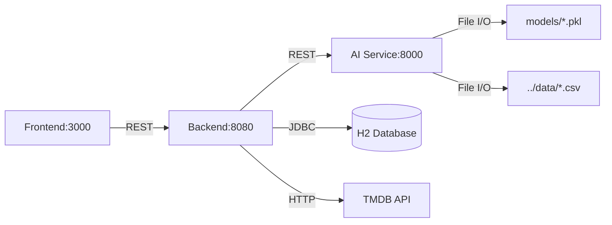

# Phase 2: Module Map

## 📦 Service Architecture Overview

The system follows a **microservices architecture** with 3 independent services:

```
CT255H-NexConflict/
├── frontend/         → Next.js 16 (TypeScript, React 19)
├── backend/          → Spring Boot 3.4.4 (Java 21)
├── ai-service/       → FastAPI (Python 3.10+)
└── data/             → MovieLens 20M Dataset (CSV files)
```

---

## 🎨 Frontend (Next.js)

### Directory Structure
```
frontend/
├── app/
│   ├── components/
│   │   ├── MovieCard.tsx        # Reusable movie card component
│   │   └── Navbar.tsx           # Navigation bar with auth state
│   ├── lib/
│   │   ├── api.ts               # Axios client with JWT interceptor
│   │   └── authContext.tsx      # React Context for auth state
│   ├── movies/[id]/
│   │   └── page.tsx             # Movie detail page (dynamic route)
│   ├── login/page.tsx           # Login form
│   ├── register/page.tsx        # Registration form
│   ├── onboarding/page.tsx      # Genre selection + movie rating
│   ├── profile/page.tsx         # User profile management
│   ├── search/page.tsx          # Movie search interface
│   ├── watchlist/page.tsx       # User's watchlist
│   ├── layout.tsx               # Root layout (metadata, fonts)
│   └── page.tsx                 # Homepage (3 personalized rows)
├── public/                      # Static assets
├── package.json                 # Dependencies (Next.js 16, React 19, Axios)
└── tsconfig.json                # TypeScript configuration
```

### Module Responsibilities

| Module | Responsibility | Dependencies |
|--------|---------------|--------------|
| **components/** | Reusable UI components | React, Next.js Link/Image |
| **lib/api.ts** | Backend API communication | Axios, localStorage (JWT) |
| **lib/authContext.tsx** | Global auth state management | React Context API |
| **pages/** | Route handlers & UI logic | All above + Tailwind CSS |

### Key Patterns
- **App Router** (Next.js 13+ convention)
- **Client Components** (`'use client'` directive for interactivity)
- **JWT Token Storage**: localStorage → Axios interceptor
- **Protected Routes**: authContext checks user state

---

## ⚙️ Backend (Spring Boot)

### Directory Structure
```
backend/src/main/java/com/example/backend/
├── config/
│   ├── DataLoader.java          # Loads movies.csv into H2 on startup
│   └── SecurityConfig.java      # JWT-based security configuration
├── controller/
│   ├── AuthController.java      # /api/auth/login, /register
│   ├── MovieController.java     # /api/movies (CRUD)
│   ├── RatingController.java    # /api/ratings (user ratings)
│   ├── WatchlistController.java # /api/watchlist (add/remove)
│   ├── RecommendationController.java  # /api/recommendations/*
│   ├── OnboardingController.java      # /api/onboarding (genre + ratings)
│   ├── UserController.java            # /api/users/me
│   └── AdminPosterController.java     # /api/admin/posters (TMDB sync)
├── dto/
│   ├── LoginRequest.java        # Request payloads
│   ├── RegisterRequest.java
│   ├── RatingRequest.java
│   ├── AuthResponse.java        # Response payloads
│   └── ...
├── entity/
│   ├── User.java                # JPA entity (users table)
│   ├── Movie.java               # JPA entity (movie table)
│   ├── Rating.java              # JPA entity (ratings table)
│   ├── Watchlist.java           # JPA entity (watchlist table)
│   ├── UserPreference.java      # Genre preferences from onboarding
│   ├── UserOnboardingRating.java # Initial ratings during onboarding
│   └── WatchHistory.java        # Watch history tracking
├── repository/
│   ├── UserRepository.java      # Spring Data JPA repositories
│   ├── MovieRepository.java
│   ├── RatingRepository.java
│   └── ...                      # (7 repositories total)
├── security/
│   ├── JwtTokenProvider.java    # JWT generation/validation (JJWT 0.11.5)
│   ├── JwtAuthenticationFilter.java  # JWT token extraction
│   ├── JwtAuthFilter.java       # Duplicate JWT filter (CODE SMELL)
│   ├── JwtUtil.java             # Duplicate JWT utility (CODE SMELL)
│   ├── JwtAuthenticationEntryPoint.java # 401 error handler
│   └── CustomUserDetailsService.java   # UserDetails implementation
├── service/
│   ├── AuthService.java         # Manual password verification
│   ├── MovieService.java        # Movie business logic + pagination
│   ├── RecommendationService.java  # AI service integration
│   └── TMDBService.java         # TMDB API poster fetching
└── Application.java             # Spring Boot entry point
```

### Module Responsibilities

| Layer | Modules | Responsibility |
|-------|---------|----------------|
| **Controller** | 8 controllers | REST API endpoints, request validation |
| **Service** | 4 services | Business logic, external API calls |
| **Repository** | 7 repositories | Database access (Spring Data JPA) |
| **Security** | 6 classes | JWT auth, filter chain, user details |
| **Entity** | 7 entities | JPA models, DB schema mapping |
| **DTO** | 8 DTOs | Request/response data contracts |
| **Config** | 2 configs | Security rules, data initialization |

### Dependency Graph
```
Controller → Service → Repository → Entity
     ↓          ↓
    DTO    Security (JWT)
```

### Database Schema (H2 In-Memory)
```
users
  ├── id (PK)
  ├── email (UNIQUE)
  ├── password (BCrypt)
  ├── fullName
  ├── role (ROLE_USER)
  └── onboardingCompleted

movies
  ├── id (PK, from dataset)
  ├── title
  ├── genres (TEXT)
  ├── posterUrl
  ├── tmdbId
  └── imdbId

ratings
  ├── id (PK)
  ├── user_id (FK → users)
  ├── movie_id (FK → movies)
  ├── rating (0.5-5.0)
  └── rated_at
  └── UNIQUE(user_id, movie_id)

watchlist
  ├── id (PK)
  ├── user_id (FK → users)
  ├── movie_id (FK → movies)
  └── added_at
  └── UNIQUE(user_id, movie_id)

user_preferences
  ├── id (PK)
  ├── user_id (FK → users)
  └── genre_name

user_onboarding_ratings
  ├── id (PK)
  ├── user_id (FK → users)
  ├── movie_id (FK → movies)
  └── rating (0.5-5.0)

watch_history
  ├── id (PK)
  ├── user_id (FK → users)
  ├── movie_id (FK → movies)
  └── watched_at
```

---

## 🤖 AI Service (FastAPI)

### Directory Structure
```
ai-service/
├── main.py              # FastAPI server + ML model endpoints
├── train.py             # Offline training script (SVD + Content-Based)
├── requirements.txt     # Python dependencies
├── models/              # Pre-trained model artifacts (*.pkl)
│   ├── svd_model.pkl    # Collaborative filtering (Surprise SVD)
│   ├── cosine_sim_matrix.pkl  # Content-based (5000x5000)
│   ├── movies_df.pkl    # Cached movies DataFrame
│   ├── ratings_df.pkl   # Cached ratings DataFrame (200K rows)
│   └── mappings.pkl     # movieId ↔ matrix index mappings
└── __pycache__/
```

### Module Responsibilities

| File | Responsibility | Lines of Code |
|------|---------------|---------------|
| **main.py** | FastAPI server, REST endpoints, fallback training | ~342 LOC |
| **train.py** | Offline model training (SVD + Genome-based Cosine Similarity) | ~331 LOC |

### API Endpoints
```
GET  /                              → Health check + model status
GET  /recommendations/{user_id}     → SVD-based personalized recs
GET  /similar/{movie_id}            → Content-based similar movies
POST /recommendations/based-on-movies  → Watchlist-based recs
GET  /health                        → Model availability check
```

### ML Pipeline (train.py)
```
1. Load Data
   ├── movies.csv (62,000+ movies)
   ├── ratings.csv (200K rows, limited for speed)
   └── genome-scores.csv (1,128 tags × movies)

2. Train SVD (Collaborative Filtering)
   ├── Algorithm: Matrix Factorization (Surprise library)
   ├── Parameters: n_factors=100, n_epochs=20, lr=0.005
   ├── Cross-validation: 3-fold RMSE/MAE
   └── Output: svd_model.pkl

3. Build Content-Based Model
   ├── Primary: Genome Scores (1,128 tags per movie)
   ├── Fallback: TF-IDF on genres (if genome missing)
   ├── Cosine Similarity Matrix: 5000×5000
   └── Output: cosine_sim_matrix.pkl, mappings.pkl

4. Save Artifacts
   └── models/*.pkl (5 files)
```

### Model Loading Strategy (main.py)
```
Startup:
  ├── Attempt: Load pre-trained models from models/
  ├── Fallback: Train on-the-fly if models missing
  └── Graceful Degradation: Return popular movies if AI fails
```

---

## 🔗 Inter-Service Communication

### Service Dependency Map


### Communication Patterns

| Source | Target | Protocol | Auth | Purpose |
|--------|--------|----------|------|---------|
| Frontend | Backend | HTTP/REST | JWT Bearer | All API calls |
| Backend | AI Service | HTTP/REST | None | Get recommendations |
| Backend | TMDB API | HTTP | API Key | Fetch movie posters |
| Backend | H2 Database | JDBC | - | Persist user data |
| AI Service | CSV Files | File I/O | - | Load MovieLens data |
| AI Service | PKL Models | File I/O | - | Load/save ML models |

### Error Handling
- **AI Service Down**: Backend returns popular movies (first 10 from DB)
- **TMDB API Limit**: System stores placeholder poster URLs
- **Database Failure**: Application crashes (no fallback)

---

## 📊 Module Complexity Analysis

### Lines of Code (Estimated)

| Service | Language | Modules | LOC | Avg LOC/File |
|---------|----------|---------|-----|--------------|
| Frontend | TypeScript | 15 files | ~2,000 | 133 |
| Backend | Java | 46 files | ~4,500 | 98 |
| AI Service | Python | 2 files | ~673 | 337 |
| **TOTAL** | - | **63 files** | **~7,173** | **114** |

### Cyclomatic Complexity Hotspots
1. **ai-service/main.py** → `get_recommendations()` (nested try/catch, loops)
2. **backend/SecurityConfig.java** → Security filter chain configuration
3. **frontend/app/page.tsx** → Conditional rendering logic (3 rows)
4. **backend/RecommendationService.java** → Multiple fallback strategies

---

## 🎯 Key Observations

### Strengths
✅ Clear separation of concerns (Frontend/Backend/AI)  
✅ RESTful API design  
✅ Modular Spring Boot architecture (Controller → Service → Repository)  
✅ ML model persistence (offline training)  

### Weaknesses
⚠️ **Duplicate JWT classes** in backend/security (3 JWT utilities/filters)  
⚠️ **No API versioning** (/api/v1/)  
⚠️ **No database migrations** (Flyway/Liquibase missing)  
⚠️ **Hardcoded URLs** (localhost:8000, localhost:8080)  
⚠️ **No service discovery** (manual URL configuration)  
⚠️ **Single AI service instance** (no horizontal scaling)  

### Missing Modules
❌ **Logging aggregation** (ELK, Splunk)  
❌ **API Gateway** (Kong, Zuul)  
❌ **Configuration server** (Spring Cloud Config)  
❌ **Caching layer** (Redis for recommendations)  
❌ **Message queue** (RabbitMQ for async tasks)  

---

## 🔄 Recommended Refactors

1. **Backend Security Package**
   - Consolidate 6 security classes → 3 (remove duplicates)
   - Single JWT utility class

2. **AI Service**
   - Split `main.py` into:
     - `app.py` (FastAPI routes)
     - `models.py` (Model loading logic)
     - `recommenders.py` (Recommendation algorithms)

3. **Frontend**
   - Extract API calls from components → `services/movieService.ts`
   - Create `types/` directory for TypeScript interfaces

4. **Configuration**
   - Use environment variables (.env files)
   - Docker Compose with all 3 services

---

**Next Steps**: Proceed to Phase 3 (Business Logic Extraction) to analyze recommendation algorithms and authentication flows.
