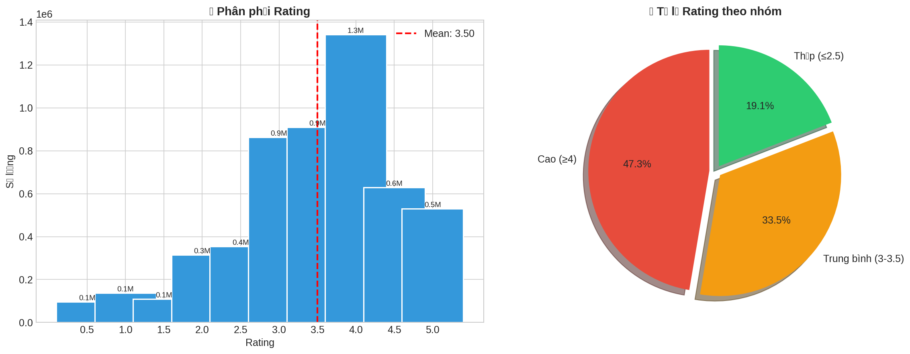
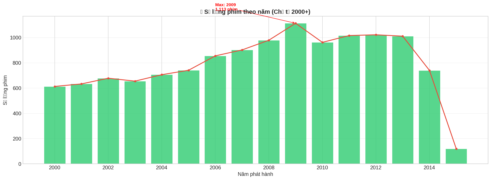
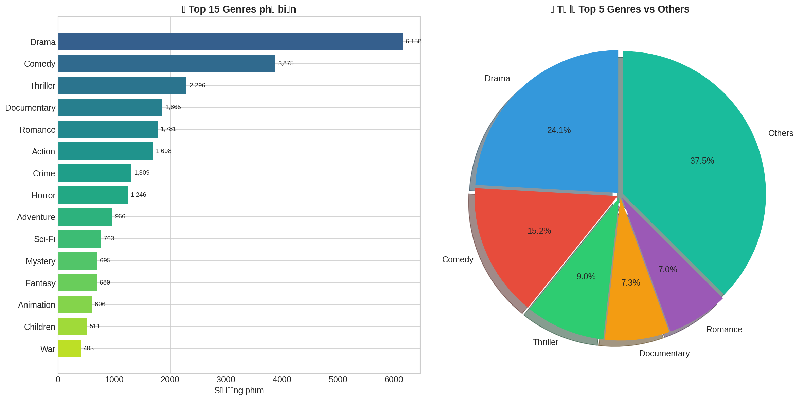
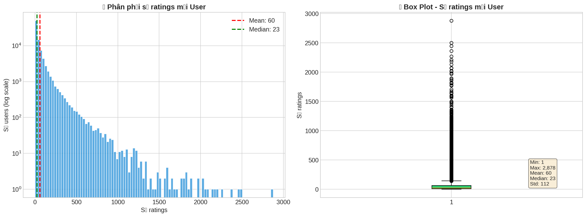
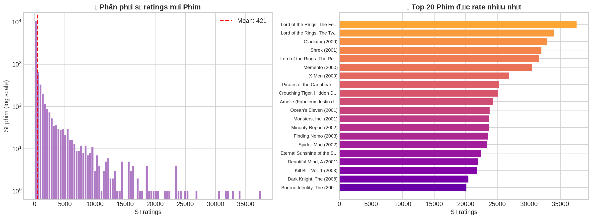
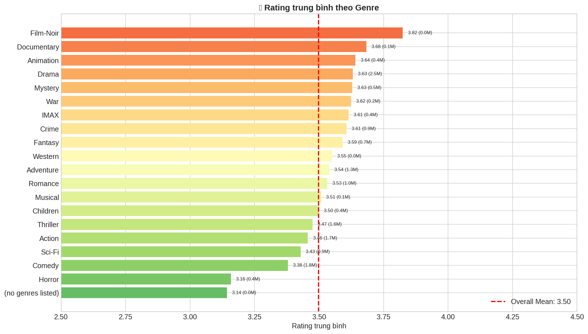

# 📊 BÁO CÁO HUẤN LUYỆN MÔ HÌNH ĐỀ XUẤT PHIM
## CT255H - Nghiệp vụ Thông minh (Business Intelligence)
### NexConflict - Hệ thống Đề xuất Phim Version 2

---

**📅 Thời gian:** 2024-2025  
**🏫 Trường:** Đại học Cần Thơ - Trường Công nghệ Thông tin và Truyền thông  

**👥 Thành viên nhóm:**
| STT | Họ và Tên | MSSV |
|-----|-----------|------|
| 1 | Nguyễn Thành Trọng | B2305615 |
| 2 | Cao Tường Hưng | B2303873 |

---

## 📋 MỤC LỤC

1. [Tổng quan](#1-tổng-quan)
2. [Dữ liệu huấn luyện](#2-dữ-liệu-huấn-luyện)
3. [Quá trình xử lý dữ liệu](#3-quá-trình-xử-lý-dữ-liệu)
4. [Phân bố dữ liệu](#4-phân-bố-dữ-liệu)
5. [Quá trình huấn luyện](#5-quá-trình-huấn-luyện)
6. [Đánh giá kết quả](#6-đánh-giá-kết-quả)
7. [Kết luận](#7-kết-luận)

---

## 1. TỔNG QUAN

### 1.1. Mục tiêu
Xây dựng hệ thống đề xuất phim sử dụng hai phương pháp chính:

| Phương pháp | Mô tả | Thuật toán |
|-------------|-------|------------|
| **Collaborative Filtering** | Dựa trên hành vi đánh giá của người dùng | SVD (Matrix Factorization) |
| **Content-Based Filtering** | Dựa trên đặc điểm nội dung phim | Cosine Similarity + TF-IDF |

### 1.2. Kiến trúc hệ thống

```
┌─────────────────────────────────────────────────────────────┐
│                    NexConflict Architecture                 │
├─────────────────────────────────────────────────────────────┤
│  Frontend          │  Backend           │  AI Service       │
│  (Next.js 15)      │  (Spring Boot)     │  (FastAPI)        │
│  Port: 3000        │  Port: 8080        │  Port: 5000       │
├─────────────────────────────────────────────────────────────┤
│                      Data Layer                             │
│              MovieLens Dataset (Filtered)                   │
│           ⚠️ Chỉ phim từ năm 2000 trở đi                    │
└─────────────────────────────────────────────────────────────┘
```

---

## 2. DỮ LIỆU HUẤN LUYỆN

### 2.1. Nguồn dữ liệu
**MovieLens 20M** - Bộ dữ liệu benchmark chuẩn trong nghiên cứu Recommender Systems, được thu thập bởi GroupLens Research.

**Nguồn:** https://grouplens.org/datasets/movielens/20m/

### 2.2. Cấu trúc dữ liệu gốc

| File | Mô tả | Số lượng |
|------|-------|----------|
| `ratings.csv` | Đánh giá của users | ~20 triệu ratings |
| `movies.csv` | Thông tin phim | ~27,000 phim |
| `genome-scores.csv` | Tag relevance scores | ~12 triệu rows |
| `genome-tags.csv` | Danh sách tags | 1,128 tags |

### 2.3. Dữ liệu sau khi lọc (Version 2)

⚠️ **Điều kiện lọc:** Chỉ giữ phim từ năm 2000 trở đi

| Thống kê | Giá trị |
|----------|---------|
| **Tổng số phim** | 12,746 phim |
| **Tổng số ratings** | 5,282,121 ratings |
| **Số users** | 87,851 users |
| **Năm phát hành** | 2000 - 2015 |

### 2.4. Cấu trúc dữ liệu Ratings

```
┌─────────┬─────────┬────────┬─────────────────────┐
│ userId  │ movieId │ rating │ timestamp           │
├─────────┼─────────┼────────┼─────────────────────┤
│ 1       │ 3889    │ 4.0    │ 2005-04-02 23:55:38 │
│ 1       │ 3996    │ 4.0    │ 2004-09-10 03:08:47 │
│ ...     │ ...     │ ...    │ ...                 │
└─────────┴─────────┴────────┴─────────────────────┘
```

**Rating scale:** 0.5 - 5.0 (bước nhảy 0.5)

---

## 3. QUÁ TRÌNH XỬ LÝ DỮ LIỆU

### 3.1. Pipeline xử lý

```
Raw MovieLens Data
        │
        ▼
┌───────────────────┐
│ 1. Load dữ liệu   │
│    - ratings.csv  │
│    - movies.csv   │
│    - genome data  │
└───────────────────┘
        │
        ▼
┌───────────────────┐
│ 2. Lọc theo năm   │
│    (≥ 2000)       │
└───────────────────┘
        │
        ▼
┌───────────────────┐
│ 3. Xử lý genres   │
│    "A|B" → "A B"  │
└───────────────────┘
        │
        ▼
┌───────────────────┐
│ 4. Chia train/test│
│    (80% / 20%)    │
└───────────────────┘
        │
        ▼
  Processed Data
```

### 3.2. Chi tiết xử lý

#### 3.2.1. Extract năm từ title
```python
def extract_year(title):
    """Trích xuất năm từ title (format: Movie Name (YYYY))"""
    match = re.search(r'\((\d{4})\)', str(title))
    if match:
        year = int(match.group(1))
        if 1900 <= year <= 2030:
            return year
    return None
```

#### 3.2.2. Xử lý Genres
- Chuyển đổi format: `"Action|Adventure"` → `"Action Adventure"`
- Sử dụng cho TF-IDF vectorization

#### 3.2.3. Chia dữ liệu Train/Test

| Tập dữ liệu | Số ratings | Tỷ lệ |
|-------------|------------|-------|
| **Training set** | 4,225,696 | 80% |
| **Test set** | 1,056,425 | 20% |
| **Số users (train)** | 87,006 | - |
| **Số items (train)** | 12,135 | - |

---

## 4. PHÂN BỐ DỮ LIỆU

### 4.1. Sparsity của dữ liệu

| Metric | Giá trị |
|--------|---------|
| **Sparsity** | 99.52% |
| **Ratings/User (TB)** | 60.1 phim |
| **Ratings/Movie (TB)** | 421.0 ratings |

→ Ma trận User-Item có **99.52% ô trống** (dữ liệu rất thưa)

### 4.2. Phân phối Rating



**Thống kê Rating:**

| Metric | Giá trị |
|--------|---------|
| **Mean** | 3.50 |
| **Std** | 1.03 |
| **Min** | 0.5 |
| **25%** | 3.0 |
| **50% (Median)** | 3.5 |
| **75%** | 4.0 |
| **Max** | 5.0 |

**Phân bố theo nhóm:**
- **Cao (≥4):** 47.3%
- **Trung bình (3-3.5):** 33.5%
- **Thấp (≤2.5):** 19.1%

### 4.3. Số lượng phim theo năm



**Nhận xét:**
- Năm có nhiều phim nhất: **2009** (1,113 phim)
- Xu hướng tăng từ 2000-2009
- Giảm dần từ 2010-2015 (do dữ liệu thu thập)

### 4.4. Phân bố Genres



**Top 10 Genres phổ biến:**

| Rank | Genre | Số phim |
|------|-------|---------|
| 1 | Drama | 6,158 |
| 2 | Comedy | 3,875 |
| 3 | Thriller | 2,296 |
| 4 | Documentary | 1,865 |
| 5 | Romance | 1,781 |
| 6 | Action | 1,698 |
| 7 | Crime | 1,309 |
| 8 | Horror | 1,246 |
| 9 | Adventure | 966 |
| 10 | Sci-Fi | 763 |

**Số genres khác nhau:** 20  
**Trung bình mỗi phim có:** 2.0 genres

### 4.5. Hoạt động của User



**Thống kê:**
- **Min:** 1 rating
- **Max:** 2,878 ratings
- **Mean:** 60 ratings/user
- **Median:** 23 ratings/user
- **Std:** 112

→ Phân phối lệch phải (right-skewed): đa số users đánh giá ít phim, một số ít đánh giá rất nhiều.

### 4.6. Độ phổ biến của Phim



**Top 10 phim được đánh giá nhiều nhất:**

| Rank | Phim | Số ratings |
|------|------|------------|
| 1 | Lord of the Rings: The Fellowship... | ~37,000 |
| 2 | Lord of the Rings: The Two Towers | ~34,000 |
| 3 | Gladiator (2000) | ~32,000 |
| 4 | Shrek (2001) | ~31,000 |
| 5 | Lord of the Rings: The Return... | ~30,000 |

**Trung bình mỗi phim:** 421 ratings

### 4.7. Rating trung bình theo Genre



**Genres có rating cao nhất:**
| Genre | Rating TB |
|-------|-----------|
| Film-Noir | 3.82 |
| Documentary | 3.68 |
| Animation | 3.64 |
| Drama | 3.63 |
| Mystery | 3.63 |

**Genres có rating thấp nhất:**
| Genre | Rating TB |
|-------|-----------|
| Horror | 3.16 |
| Comedy | 3.38 |
| Sci-Fi | 3.43 |

**Overall Mean:** 3.50

---

## 5. QUÁ TRÌNH HUẤN LUYỆN

### 5.1. Model 1: SVD (Collaborative Filtering)

#### 5.1.1. Lý thuyết SVD

**Ý tưởng chính:** Phân tích ma trận User-Item thành tích của các ma trận nhỏ hơn.

$$R \approx P \times Q^T$$

Trong đó:
- $R$: Ma trận ratings (m users × n items)
- $P$: Ma trận user factors (m × k)
- $Q$: Ma trận item factors (n × k)
- $k$: Số latent factors

**Công thức dự đoán:**
$$\hat{r}_{ui} = \mu + b_u + b_i + p_u \cdot q_i$$

- $\mu$: Global mean rating
- $b_u$: User bias
- $b_i$: Item bias
- $p_u \cdot q_i$: Dot product của latent vectors

#### 5.1.2. Hyperparameters

| Parameter | Giá trị | Mô tả |
|-----------|---------|-------|
| `n_factors` | 100 | Số latent factors |
| `n_epochs` | 20 | Số vòng lặp training |
| `lr_all` | 0.005 | Learning rate |
| `reg_all` | 0.02 | Regularization |
| `random_state` | 42 | Seed cho reproducibility |

#### 5.1.3. Quá trình Training

```
Training SVD Model
==================
📈 Processing epoch 0 → 19
⏱️ Thời gian training: 72.25 giây (1.2 phút)
✅ Training hoàn tất!
```

#### 5.1.4. Kết quả đánh giá

| Metric | Test Set | Cross-Validation (5-Fold) |
|--------|----------|---------------------------|
| **RMSE** | 0.7915 | 0.7916 (± 0.0004) |
| **MAE** | 0.5920 | 0.5923 (± 0.0003) |

🏆 **Excellent! RMSE < 0.9** - Model đạt hiệu suất tốt!

#### 5.1.5. Cross-Validation Detail

```
                  Fold 1  Fold 2  Fold 3  Fold 4  Fold 5  Mean    Std
RMSE (testset)    0.7917  0.7916  0.7912  0.7923  0.7910  0.7916  0.0004
MAE (testset)     0.5923  0.5925  0.5922  0.5927  0.5918  0.5923  0.0003
Fit time          72.46   76.26   75.71   75.91   75.45   75.16   1.38
Test time         16.49   17.65   17.95   19.38   17.39   17.77   0.94
```

**Tổng thời gian Cross-Validation:** 529.4 giây (~8.8 phút)

---

### 5.2. Model 2: Content-Based Filtering

#### 5.2.1. Lý thuyết

**Ý tưởng:** Đề xuất phim có nội dung tương tự với phim user đã thích.

**Phương pháp:**

1. **TF-IDF (Term Frequency - Inverse Document Frequency):**
   - Chuyển genres text thành vector số
   - TF: Tần suất của term trong document
   - IDF: Độ hiếm của term trong toàn bộ corpus

2. **Cosine Similarity:**
   $$sim(A, B) = \frac{A \cdot B}{||A|| \times ||B||}$$
   - Đo độ tương tự giữa 2 vectors
   - Giá trị từ 0 (khác hoàn toàn) đến 1 (giống hệt)

#### 5.2.2. Cấu hình TF-IDF Vectorizer

| Parameter | Giá trị | Mô tả |
|-----------|---------|-------|
| `stop_words` | 'english' | Loại bỏ stopwords |
| `min_df` | 5 | Bỏ qua term xuất hiện < 5 lần |
| `max_df` | 0.95 | Bỏ qua term xuất hiện > 95% docs |

#### 5.2.3. Kết quả TF-IDF

| Metric | Giá trị |
|--------|---------|
| **TF-IDF Matrix shape** | (12,746 × 23) |
| **Số features (genres)** | 23 |
| **Thời gian vectorization** | 0.05 giây |

**Features (genres):**
```
['action', 'adventure', 'animation', 'children', 'comedy', 
 'crime', 'documentary', 'drama', 'fantasy', 'fi', 'film', 
 'genres', 'horror', 'imax', 'listed', 'musical', 'mystery', 
 'noir', 'romance', 'sci', 'thriller', 'war', 'western']
```

#### 5.2.4. Cosine Similarity Matrix

| Metric | Giá trị |
|--------|---------|
| **Matrix shape** | (12,746 × 12,746) |
| **Memory usage** | 1,299.7 MB |
| **Thời gian tính** | 2.06 giây |

---

## 6. ĐÁNH GIÁ KẾT QUẢ

### 6.1. So sánh hai phương pháp

| Tiêu chí | SVD | Content-Based |
|----------|-----|---------------|
| **Loại** | Collaborative Filtering | Content-Based |
| **Cá nhân hóa** | ✅ Cao | ⚠️ Trung bình |
| **Cold-start** | ❌ Có vấn đề | ✅ Không vấn đề |
| **Diversity** | ✅ Cao | ⚠️ Thấp |
| **Scalability** | ✅ Tốt | ⚠️ Tốn bộ nhớ |
| **Explainability** | ❌ Khó giải thích | ✅ Dễ giải thích |

### 6.2. Ưu nhược điểm

#### SVD (Collaborative Filtering)
| Ưu điểm | Nhược điểm |
|---------|------------|
| Cá nhân hóa cao | Cold-start problem |
| Phát hiện patterns ẩn | Cần nhiều dữ liệu |
| Scalable | Khó giải thích |

#### Content-Based Filtering
| Ưu điểm | Nhược điểm |
|---------|------------|
| Không cần dữ liệu user khác | Thiếu diversity |
| Giải quyết cold-start | Giới hạn bởi features |
| Dễ giải thích | Không phát hiện patterns mới |

### 6.3. Kết quả cuối cùng

#### SVD Model Performance

| Metric | Giá trị | Đánh giá |
|--------|---------|----------|
| **RMSE** | 0.7915 | 🏆 Excellent (< 0.9) |
| **MAE** | 0.5920 | ✅ Good |
| **CV Stability** | ± 0.0004 | ✅ Rất ổn định |

#### Models đã lưu

| File | Kích thước |
|------|------------|
| `svd_model.pkl` | 198.83 MB |
| `cosine_sim_matrix.pkl` | 1,299.68 MB |
| `content_mappings.pkl` | 0.19 MB |
| `movies_df.pkl` | 0.68 MB |
| `ratings_df.pkl` | 240.86 MB |
| **TỔNG** | **1,740.24 MB** |

---

## 7. KẾT LUẬN

### 7.1. Tóm tắt kết quả

✅ **Đã hoàn thành thành công việc training 2 models:**

1. **SVD Model (Collaborative Filtering)**
   - RMSE: 0.7915 - Đạt mức "Excellent"
   - Cross-validation ổn định với độ lệch chuẩn rất nhỏ (0.0004)
   - Thời gian training: ~1.2 phút

2. **Content-Based Model (TF-IDF + Cosine Similarity)**
   - Matrix similarity: 12,746 × 12,746
   - Thời gian xử lý: ~2 giây
   - Phù hợp cho đề xuất phim tương tự

### 7.2. Đặc điểm dữ liệu

- **Dữ liệu thưa (99.52% sparsity):** Phù hợp với SVD
- **Phân bố rating thiên cao:** Người dùng có xu hướng đánh giá phim đã xem
- **Long-tail distribution:** Đa số phim có ít ratings

### 7.3. Đề xuất cải tiến

1. **Hybrid Model:** Kết hợp SVD và Content-Based để tận dụng ưu điểm cả hai
2. **Deep Learning:** Sử dụng Neural Collaborative Filtering
3. **Feature Engineering:** Thêm các features như actors, directors, keywords
4. **Real-time Update:** Cập nhật model theo thời gian thực

### 7.4. Bước tiếp theo

1. ✅ Copy thư mục `models/` vào `ai-service/models/`
2. ✅ Chạy AI Service: `python main.py`
3. ✅ Test API endpoints
4. ✅ Tích hợp với Frontend và Backend

---

**📅 Ngày hoàn thành training:** 2024  
**🛠️ Môi trường:** Google Colab (GPU T4)  
**📦 Thư viện chính:** scikit-surprise 1.1.4, scikit-learn, pandas, numpy

---

*Báo cáo được tạo tự động từ notebook CT255H_Movie_Recommendation_Training_v2.ipynb*
