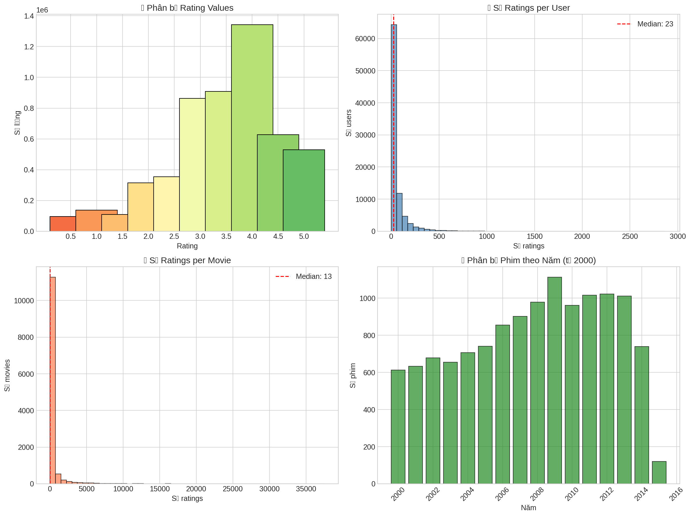
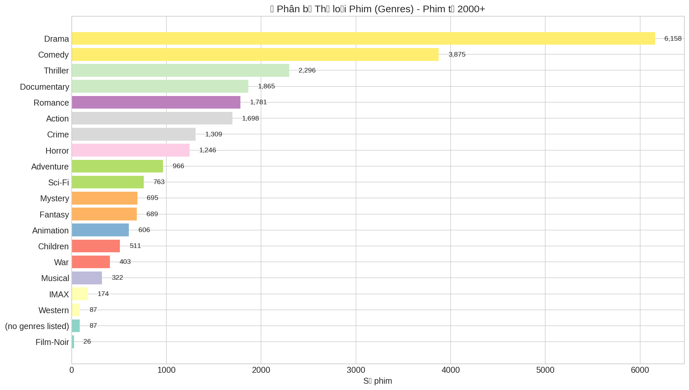
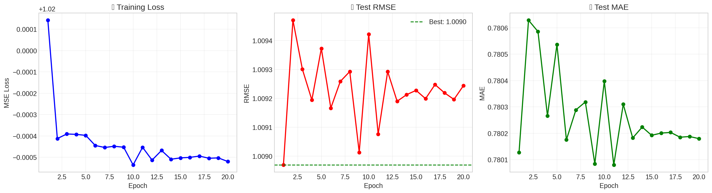
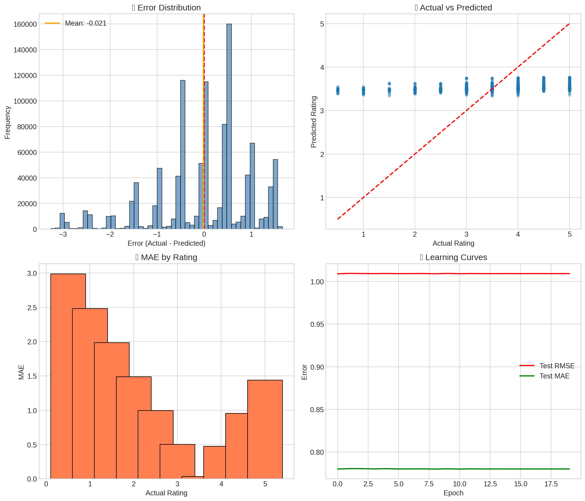

# ĐẠI HỌC CẦN THƠ
## TRƯỜNG CÔNG NGHỆ THÔNG TIN & TRUYỀN THÔNG

**BÁO CÁO**

**MÔN NGHIỆP VỤ THÔNG MINH (CT255H – M01)**

**Đề tài**

**PHÁT TRIỂN HỆ THỐNG GỢI Ý PHIM**

**Nhóm sinh viên:**
- Cao Tường Hưng - B2303873
- Nguyễn Thanh Trọng – B2303873

**Cần Thơ, 3/2026**

## NHẬN XÉT CỦA GIÁO VIÊN HƯỚNG DẪN

.………...………...………...………...………...………...…………………
.………...………...………...………...………...………...…………………
.………...………...………...………...………...………...………………………….………...………...………...………...………...………...………...………………………….………...………...………...………...………...………...………...………………………….………...………...………...………...………...………...………...………………………….………...………...………...………...………...………...………...………………………….………...………...………...………...………...………...………...………………………….………...………...………...………...………...………...………...………………………….………...………...………...………...………...………...………...………………………….………...………...………...………...………...………...………...………………………….………...………...………...………...………...………...………...………………………….………...………...………...………...………...………...………...………………………….………...………...………...………...………...………...………...………………………….………...………...………...………...………...………...………...………………………….………...………...………...………...………...………...………...………………………….………...………...………...………...………...………...………...………………………….………...………...………...………...………...………...………...………………………….………...………...………...………...………...………...………...………………………….………...………...………...………...………...………...………...………………………….………...………...………...………...………...………...………...………………………….………...………...………...………...………...………...………...………………………….………...………...………...………...………...………...………...……………………………………………

Cần Thơ, ngày … … tháng … … năm 2026

**Giáo viên hướng dẫn**

## MỤC LỤC

- NHẬN XÉT CỦA GIÁO VIÊN HƯỚNG DẪN.. i
- MỤC LỤC.. ii
- DANH MỤC BẢNG.. iv
- DANH MỤC HÌNH ẢNH.. v
- DANH MỤC TỪ VIẾT TẮT.. vi
- TÓM TẮT.. vii
- ABSTRACT.. viii
- PHẦN GIỚI THIỆU.. 9
- 1. Đặt vấn đề. 9
- 2. Lịch sử giải quyết vấn đề. 9
- 3. Mục tiêu đề tài. 9
- 4. Đối tượng và phạm vi nghiên cứu. 10
- 4.1. Đối tượng nghiên cứu. 10
- 4.2. Phạm vi nghiên cứu. 10
- 5. Phương pháp và nội dung nghiên cứu. 10
- 5.1. Phương pháp nghiên cứu. 10
- 5.2. Nội dung nghiên cứu. 11
- 5.2.1. Quy trình thực hiện. 11
- 5.2.2. Công nghệ cho phát triển ứng dụng. 11
- 6. Bố cục luận văn. 11
- PHẦN NỘI DUNG.. 12
- CHƯƠNG 1. MÔ TẢ BÀI TOÁN PHÁT TRIỂN HỆ THỐNG ĐẶT PHÒNG HOMESTAY 12
- 1. Giới thiệu. 12
- 2. Các yêu cầu chức năng. 12
- 2.1. Các trường hợp sử dụng của khách hàng. 12
- 2.1.1. Sơ đồ trường hợp sử dụng. 12
- 2.1.2. Gợi ý phim.. 13
- 2.1.3. Xem chi tiết phim.. 14
- CHƯƠNG 2. CƠ SỞ LÝ THUYẾT.. 15
- 1. Kiến trúc phân tầng N-layer. 15
- 2. Lọc cộng tác với thuật toán SVD (Singular Value Decomposition). 15
- 2.1. Ý tưởng chính. 15
- 2.2. Công thức dự đoán. 16
- 3. Lọc theo nội dung với Cosine Similarity. 16
- 3.1. Lý thuyết Cosine Similarity. 16
- CHƯƠNG 3. THIẾT KẾ VÀ CÀI ĐẶT GIẢI PHÁP. 17
- 3.1 Kiến trúc hệ thống. 17
- 3.2 Sơ đồ dữ liệu. 18
- 1.1. Chức năng đặt phòng homestay. 19
- CHƯƠNG 4. KẾT QUẢ THỰC THI. 20
- 1. Mục tiêu kiểm thử. 20
- 2. Phạm vi kiểm thử. 20
- 2.1. Các chức năng được kiểm thử. 20
- 2.2. Các chức năng không kiểm thử. 20
- 3. Chiến lược kiểm thử. 20
- 3.1. Phương pháp tiếp cận. 20
- 3.2. Các cấp độ kiểm thử áp dụng. 21
- 3.3. Môi trường kiểm thử. 21
- 2.1.4. Cấu hình phần cứng tối thiểu. 21
- 2.1.5. Cấu hình phần mềm. 21
- 2.1.6. Thiết bị di động và trình giả lập. 22
- 2.1.7. Công cụ hỗ trợ kiểm thử. 22
- 2.1.8. Các điều kiện thiết lập khác. 22
- 3.4. Dữ liệu kiểm thử. 22
- 4. Các trường hợp kiểm thử. 24
- 4.1. Kiểm thử chức năng chủ homestay thêm phòng mới. 24
- 4.2. Kiểm thử chức năng khách hàng đặt phòng. 25
- 5. Đánh giá kết quả kiểm thử. 27
- PHẦN KẾT LUẬN.. 28
- 1. Kết quả đạt được. 28
- 1.1. Về kiến thức và kỹ năng. 28
- 1.2. Về chương trình và khả năng ứng dụng trong thực tiễn. 28
- 2. Hạn chế và khó khăn. 28
- 3. Hướng phát triển. 28
- TÀI LIỆU THAM KHẢO.. 29
- PHỤ LỤC.. 1

## DANH MỤC BẢNG

- Bảng 1: Yêu cầu chức năng Gợi ý phim............................................................................... 6
- Bảng 2: Chức năng Xem chi tiết phim.................................................................................. 6
- Bảng 6: Các thành phần trong giao diện Lên kế hoạch du lịch với AI........................... 12
- Bảng 7: Dữ liệu sử dụng trong Lên kế hoạch du lịch với AI........................................... 13
- Bảng 8: Bảng kiểm tra chức năng chủ homestay thêm phòng mới................................. 19
- Bảng 9: Bảng kiểm tra chức năng khách hàng đặt phòng................................................ 20
- Bảng 10: Bảng tổng hợp kết quả kiểm thử......................................................................... 22

## DANH MỤC HÌNH ẢNH

- Hình 1: Kiến trúc hệ thống................................................................................................... 17
- Hình 2: Sơ đồ ERD................................................................................................................ 18
- Hình 6: Sơ đồ cách xử lý Lên kế hoạch du lịch với AI.................................................... 19

## DANH MỤC TỪ VIẾT TẮT

| STT | Thuật ngữ/ Viết tắt | Định nghĩa/ Giải thích |
| --- | ------------------- | ----------------------- |
| 1 | SVD | SVD-Singular Value Decomposition là một phương pháp trong đại số tuyến tính dùng để phân rã một ma trận lớn thành các thành phần đơn giản hơn. |
| 2 | Framework | Bộ khung phát triển phần mềm – tập hợp các đoạn mã, thư viện và công cụ hỗ trợ lập trình, giúp xây dựng ứng dụng nhanh chóng và hiệu quả. |
| 3 | API | Application Programming Interface – Giao diện lập trình ứng dụng, giúp các hệ thống phần mềm giao tiếp và trao đổi dữ liệu với nhau. |

## TÓM TẮT

Bối cảnh: Sự phát triển bùng nổ của các nền tảng nội dung số hiện đại đã dẫn đến tình trạng quá tải thông tin do đó người dùng thường gặp khó khăn và mất nhiều thời gian trong việc tìm kiếm các bộ phim phù hợp với sở thích cá nhân giữa hàng triệu lựa chọn. Bên cạnh đó, các hệ thống thường gặp rào cản lớn trong việc đề xuất nội dung cho người dùng mới vì hệ thống chưa có dữ liệu về sở thích phim của họ.

Mục tiêu: Đề tài hướng tới việc xây dựng và phát triển một hệ thống web gợi ý phim thông minh. Mục tiêu cốt lõi là nâng cao trải nghiệm người dùng thông qua các đề xuất mang tính cá nhân hóa cao, đồng thời thiết kế một luồng xử lý riêng biệt để giải quyết triệt để vấn đề khởi tạo dữ liệu cho tài khoản mới.

Phương pháp: Ứng dụng được thiết kế theo kiến trúc monolith nhằm tối ưu hóa hiệu năng. Giao diện người dùng sử dụng framework Next.js. Lõi xử lý nghiệp vụ được xây dựng bằng Java Spring Boot kết hợp cơ sở dữ liệu PostgreSQL. Đặc biệt, phân hệ Trí tuệ nhân tạo được triển khai độc lập bằng Python thông qua FastAPI. Hệ thống áp dụng phương pháp Gợi ý lai, kết hợp thuật toán Lọc cộng tác để gợi ý phim dựa trên hành vi người dùng, và thuật toán Lọc theo nội dung (Cosine Similarity tính toán trên bộ Genome scores 1,128 chiều) để đề xuất các phim có độ tương đồng sâu sắc về mặt nội dung.

Kết quả: Quá trình nghiên cứu và cài đặt đã tạo ra một hệ thống gợi ý phim hoạt động ổn định và có khả năng mở rộng tốt. Hệ thống vận hành thành công hai luồng người dùng biệt lập: thu thập sở thích mồi cho người dùng mới và cung cấp danh sách phim được cá nhân hóa theo thời gian thực cho người dùng cũ, chứng minh được tính hiệu quả của việc phân tách module AI và module Web trong thực tế.

## ABSTRACT

Background: The explosive growth of modern digital content platforms has led to information overload. Users often face difficulties and spend a lot of time searching for movies that match their personal preferences among millions of choices. Furthermore, recommendation systems frequently encounter major barriers when suggesting content to new users.

Objective: The project aims to architect and develop a smart movie recommendation web system. The core objective is to enhance the user experience through highly personalized recommendations, while designing a separate processing flow to completely resolve the data initialization issue for new accounts.

Methodology: The application is designed using a monolith architecture to optimize performance. The user interface Frontend utilizes the Next.js framework. The business processing core is built with Java Spring Boot combined with a PostgreSQL database. Specifically, the Artificial Intelligence module is deployed independently using Python. The system applies a Hybrid Recommender System method, combining Collaborative Filtering to suggest movies based on user behavior, and Content-Based Filtering (Cosine Similarity calculated on a 1,128-dimensional Genome scores dataset) to recommend movies with deep content similarity.

Results: The research and implementation process produced a stable and highly scalable movie recommendation system. The system successfully operates two isolated user flows: collecting initial preferences for new users and providing real-time personalized movie lists for returning users, proving the practical effectiveness of decoupling the AI module from the Web module.

## PHẦN GIỚI THIỆU

### 1. Đặt vấn đề

Trong kỷ nguyên bùng nổ của các nền tảng nội dung số và dịch vụ phát trực tuyến hiện nay, lượng dữ liệu phim ảnh được sản xuất và phân phối mỗi ngày là khổng lồ. Điều này dẫn đến một nghịch lý đối với người dùng làm cho họ bị quá tải thông tin. Khách hàng ngày càng mất nhiều thời gian hơn để cuộn qua các danh mục mà không thể tìm thấy một bộ phim thực sự phù hợp với gu thưởng thức của mình. Đồng thời, đứng ở góc độ nhà cung cấp dịch vụ, bài toán Cold-Start đối với những người dùng mới tạo tài khoản khi đó khi hệ thống chưa có bất kỳ dữ liệu lịch sử nào để đưa ra gợi ý luôn là một thách thức kỹ thuật lớn. Việc không thể đưa ra những gợi ý chính xác ngay từ những tương tác đầu tiên sẽ làm giảm tỷ lệ giữ chân người dùng. Xuất phát từ tính cấp thiết đó, đề tài "Xây dựng hệ thống gợi ý phim" được thực hiện nhằm xây dựng một giải pháp kỹ thuật toàn diện, ứng dụng trí tuệ nhân tạo để cá nhân hóa trải nghiệm người dùng ngay từ lúc họ vừa gia nhập nền tảng.

### 2. Lịch sử giải quyết vấn đề

Trước đây, các hệ thống gợi ý truyền thống thường chỉ áp dụng một trong hai phương pháp đơn lẻ:

- Lọc theo nội dung: Chỉ tập trung vào các đặc trưng bề mặt của phim (như thể loại, đạo diễn) khiến cho các gợi ý bị lặp đi lặp lại một màu, thiếu đi tính đột phá cho người xem.
- Lọc cộng tác: Dựa vào hành vi đánh giá của đám đông để gợi ý, nhưng lại hoàn toàn thất bại và rỗng dữ liệu khi đối mặt với lượng người dùng mới và đó là vấn đề Cold Start.

### 3. Mục tiêu đề tài

Mục tiêu tổng quát: Thiết kế và xây dựng thành công một website cung cấp thông tin và gợi ý phim ảnh mang tính cá nhân hóa cao, tích hợp trí tuệ nhân tạo để giải quyết bài toán cốt lõi là hỗ trợ người dùng ra quyết định chọn phim nhanh chóng, chính xác.

Mục tiêu cụ thể:

- Xây dựng giao diện người dùng thân thiện, phản hồi nhanh chóng các thao tác tìm kiếm, lọc và xem thông tin phim.
- Xây dựng luồng xử lý Onboarding dành riêng cho người dùng mới để thu thập sở thích ban đầu, khắc phục bài toán Cold Start đã nhắc đến trước đó.
- Cài đặt thuật toán Lọc theo nội dung dùng thuật toán Cosine Similarity dựa trên Genome scores phục vụ cho tính năng gợi ý phim tương tự có chiều sâu về ngữ nghĩa.

### 4. Đối tượng và phạm vi nghiên cứu

#### 4.1. Đối tượng nghiên cứu

- Các thuật toán cốt lõi trong lĩnh vực Machine Learning áp dụng cho Hệ thống gợi ý như Singular Value Decomposition (SVD) và Cosine Similarity.
- Hành vi, thói quen và quy trình tương tác của người dùng trên các nền tảng giải trí trực tuyến.
- Quy trình tích hợp mã nguồn Trí tuệ nhân tạo vào chung một khối ứng dụng Web duy nhất.

#### 4.2. Phạm vi nghiên cứu

Để đảm bảo tính khả thi và tập trung, đề tài được giới hạn trong các phạm vi sau:

- Về mặt dữ liệu: Giới hạn sử dụng tập dữ liệu MovieLens 20M Dataset, trong đó đã được tiền xử lý và chỉ lọc ra các bộ phim được phát hành từ năm 2000 trở đi để phù hợp với thị hiếu người dùng hiện đại.
- Về mặt chức năng: Tập trung hoàn thiện các tính năng cốt lõi bao gồm Đăng ký/Đăng nhập, Quá trình Onboarding, Xem chi tiết phim, Tìm kiếm phim và tính toán trả về danh sách phim gợi ý. Không bao gồm tính năng thanh toán hay xem phim trực tuyến.
- Về kiến trúc phần mềm: Hệ thống được phát triển và triển khai dưới dạng kiến trúc Nguyên khối.

### 5. Phương pháp và nội dung nghiên cứu

#### 5.1. Phương pháp nghiên cứu

Trong quá trình thực hiện niên luận, đề tài đã được triển khai dựa trên ba phương pháp nghiên cứu chính: nghiên cứu tài liệu, quan sát và thực nghiệm.

- Phương pháp nghiên cứu tài liệu: Tập trung vào việc tổng hợp và phân tích các bài báo khoa học, tài liệu kỹ thuật chuẩn về Hệ thống gợi ý. Cụ thể là nghiên cứu sâu về nền tảng toán học của thuật toán Singular Value Decomposition và Cosine Similarity, cũng như các tài liệu đặc tả của framework Spring Boot và Next.js.
- Phương pháp quan sát và phân tích: Khảo sát các nền tảng nội dung số hàng đầu hiện nay để rút ra các Best Practice trong luồng trải nghiệm người dùng, đặc biệt là cách họ thu thập dữ liệu ban đầu để giải quyết vấn đề Cold-Start.
- Phương pháp thực nghiệm: Được áp dụng xuyên suốt trong quá trình thiết kế, lập trình và tinh chỉnh mô hình. Quá trình này bao gồm việc tiền xử lý tập dữ liệu MovieLens 20M, huấn luyện thuật toán nhiều lần với các siêu tham số khác nhau để tìm ra cấu hình tối ưu nhất (n_factors = 100, n_epochs = 20) dựa trên độ đo RMSE và MAE.

#### 5.2. Nội dung nghiên cứu

##### 5.2.1. Quy trình thực hiện

1. Khảo sát và Phân tích yêu cầu: Thu thập yêu cầu hệ thống, phân tích bài toán Cold-Start và xác định luồng dữ liệu cho hệ thống.
2. Thiết kế hệ thống: Thiết kế kiến trúc phần mềm nguyên khối đóng gói các module chức năng. Thiết kế cơ sở dữ liệu vật lý trên PostgreSQL.
3. Phát triển thuật toán: Tiền xử lý dữ liệu, cài đặt mô hình SVD bằng scikit-surprise và Content-Based bằng scikit-learn.
4. Lập trình ứng dụng: Xây dựng các API cốt lõi với Java Spring Boot và phát triển giao diện người dùng tương tác với Next.js.

##### 5.2.2. Công nghệ cho phát triển ứng dụng

- Frontend: Sử dụng framework Next.js kết hợp Tailwind CSS để tối ưu hóa việc Server-Side Rendering và Client-Side Routing, mang lại trải nghiệm mượt mà.
- Backend Core: Sử dụng Java 21 và framework Spring Boot để xử lý các logic xác thực JWT, giao tiếp cơ sở dữ liệu Spring Data JPA.
- AI & Machine Learning Module: Sử dụng ngôn ngữ Python với các thư viện pandas, numpy, scikit-learn và scikit-surprise để xử lý thuật toán cốt lõi. Giao tiếp nội bộ qua FastAPI.
- Cơ sở dữ liệu: PostgreSQL được sử dụng để lưu trữ dữ liệu nghiệp vụ. Các tập tin ma trận lớn (CSV, PKL) được load trực tiếp lên RAM để phục vụ xử lý Machine Learning tốc độ cao.

### 6. Bố cục luận văn

Luận văn được cấu trúc thành các phần chính như sau:

- Phần Giới thiệu: Trình bày bối cảnh, lý do chọn đề tài, mục tiêu, đối tượng, phạm vi nghiên cứu và phương pháp thực hiện.
- Chương 1 - Mô tả bài toán: Phân tích chi tiết các yêu cầu chức năng, phi chức năng và mô tả các luồng nghiệp vụ cốt lõi của người dùng mới và cũ.
- Chương 2 - Cơ sở lý thuyết: Cung cấp nền tảng kiến thức về Hệ thống gợi ý, thuật toán SVD, thuật toán Cosine Similarity và các công nghệ sử dụng.
- Chương 3 - Thiết kế và Cài đặt giải pháp: Trình bày chi tiết về kiến trúc Monolith của hệ thống, thiết kế cơ sở dữ liệu PostgreSQL và các sơ đồ hoạt động của tính năng AI.

## PHẦN NỘI DUNG

### CHƯƠNG 1. MÔ TẢ BÀI TOÁN PHÁT TRIỂN HỆ THỐNG ĐẶT PHÒNG HOMESTAY

#### 1. Giới thiệu

Hệ thống gợi ý phim là một sản phẩm phần mềm được phát triển độc lập, phục vụ cho nhu cầu tìm kiếm và khám phá nội dung giải trí trực tuyến. Hệ thống được thiết kế theo kiến trúc nguyên khối theo dạng module, trong đó phân hệ Web gồm xử lý giao diện, xác thực JWT, lưu trữ dữ liệu PostgreSQL và phân hệ AI để chạy thuật toán Machine Learning được đóng gói và vận hành đồng bộ trên cùng một máy chủ vật lý. Điều này giúp loại bỏ hoàn toàn độ trễ mạng trong quá trình giao tiếp nội bộ giữa các luồng xử lý.

#### 2. Các yêu cầu chức năng

Các trường hợp sử dụng tiêu biểu của ứng dụng sẽ được trình bày một cách chi tiết, tập trung vào những chức năng cốt lõi thể hiện rõ sức mạnh tích hợp của Trí tuệ nhân tạo vào quy trình nghiệp vụ.

##### 2.1. Các trường hợp sử dụng của khách hàng

###### 2.1.1. Sơ đồ trường hợp sử dụng

###### 2.1.2. Gợi ý phim

**Bảng 1: Yêu cầu chức năng Gợi ý phim**

| Gợi ý phim | ID: UC_01 |
| --- | --- |
| Tác nhân chính: Người dùng | Mức độ cần thiết: Bắt buộc |
| Phân loại: Phức tạp | |
| Các thành phần tham gia và mối quan tâm: - Người dùng: Muốn tìm phim thích hợp với sở thích, tiết kiệm thời gian xem và đọc review - Hệ thống: Tạo gợi ý tự động dựa trên thông tin ban đầu mà người dùng đã chọn và cung cấp cho hệ thống. | |
| Mô tả tóm tắt: Chức năng “Gợi ý phim” cung cấp một số phim hệ thống thấy phù hợp với người dùng - Nhập thông tin đầu vào: Thể loại phim, số sao đánh giá cho vài phim. - Hệ thống đề xuất phim phù hợp với dữ liệu người dùng cung cấp. - Hiển thị kết quả: Gửi kết quả phim phù hợp với người dùng trên giao diện. | |
| Các mối quan hệ: +Association (kết hợp): Khách hàng +Include (bao gồm): Đăng nhập +Extend (mở rộng): Không có +Generalization (tổng quát hóa): Không có | |
| Luồng xử lý bình thường của sự kiện: 1. Khách hàng đăng nhập vào hệ thống. 2. Hiển thị các thể loại phim để người dùng chọn. 3. Khách hàng đánh giá khoảng 5 phim hệ thống đề xuất. 4. Hệ thống xử lý dữ liệu thông qua AI service. 5. Hệ thống chuẩn hóa dữ liệu trả về và tìm kiếm phim phù hợp từ cơ sở dữ liệu. 6. Hệ thống hiển thị kết quả cho người dùng xem và lựa chọn. | |
| Các luồng sự kiện con (Subflows): 1. Xử lý gợi ý phim: - Lọc phim theo thể loại, gen của phim người dùng đã nhập vào. | |
| Luồng luân phiên/đặc biệt (Alternate/Exceptional flows): 1. Nếu có lỗi khi gọi AI hoặc không có kết quả: Hiển thị thông báo: "Có lỗi. Vui lòng thử lại sau." | |

###### 2.1.3. Xem chi tiết phim

**Bảng 2: Chức năng Xem chi tiết phim**

| Xem chi tiết phim | ID: UC_02 |
| --- | --- |
| Tác nhân chính: Người dùng | Mức độ cần thiết: Bắt buộc |
| Phân loại: Đơn giản | |
| Các thành phần tham gia và mối quan tâm: - Người dùng: Người dùng muốn xem tên và thể loại cụ thể của phim. | |
| Mô tả tóm tắt: Chức năng xem chi tiết phim cho phép người dùng xem chi tiết tên, năm sản xuất, thể loại của phim. | |
| Các mối quan hệ: +Association (kết hợp): Không có +Include (bao gồm): Đăng nhập +Extend (mở rộng): Không có +Generalization (tổng quát hóa): Không có | |
| Luồng xử lý bình thường của sự kiện: 1. Khách hàng đăng nhập vào hệ thống. 2. Hệ thống hiển thị danh sách phim. 3. Khách hàng chọn phim muốn xem. 4. Hệ thống hiển thị trang chi tiết phim. | |
| Các luồng sự kiện con (Subflows): Không có | |
| Luồng luân phiên/đặc biệt (Alternate/Exceptional flows): Không có | |

### CHƯƠNG 2. CƠ SỞ LÝ THUYẾT

#### 1. Kiến trúc phân tầng N-layer

N-Layer Architecture là một mẫu kiến trúc phân chia ứng dụng thành nhiều tầng logic tách biệt nhau. Mỗi tầng chịu một trách nhiệm duy nhất và điều này đảm bảo được phần Single Responsibility trong nguyên lý SOLID và chỉ được phép giao tiếp với tầng ngay bên dưới nó. Việc áp dụng kiến trúc N-Layer giúp hệ thống dễ dàng mở rộng, bảo trì và cô lập lỗi trong quá trình phát triển.

Trong hệ thống Backend phát triển bằng Java Spring Boot, kiến trúc được chia thành 3 tầng cốt lõi như sau:

- Tầng Điều Khiển: Chứa các Controller như MovieController, RecommendationController. Tầng này chịu trách nhiệm tiếp nhận HTTP Request từ Frontend, xác thực quyền truy cập thông qua module security, và trả về dữ liệu cho Client dưới định dạng DTO.
- Tầng Nghiệp vụ: Chứa các Service. Đây là trái tim của hệ thống, nơi xử lý toàn bộ logic nghiệp vụ, tính toán, và đóng vai trò làm người điều phối để gọi các API nội bộ sang module AI.
- Tầng Truy xuất dữ liệu: Chứa các Repository kế thừa từ Spring Data JPA. Tầng này chịu trách nhiệm giao tiếp trực tiếp với cơ sở dữ liệu PostgreSQL để thực hiện các thao tác lên các Entity.

#### 2. Lọc cộng tác với thuật toán SVD (Singular Value Decomposition)

##### 2.1. Ý tưởng chính

Singular Value Decomposition (SVD) là một kỹ thuật phân rã ma trận (Matrix Factorization) nòng cốt trong phương pháp Lọc cộng tác (Collaborative Filtering). Thuật toán này phân rã ma trận đánh giá ban đầu $R$ (có kích thước User $\times$ Movie) thành tích của 3 ma trận nhỏ hơn nhằm khám phá các đặc trưng ẩn (latent factors) của người dùng và bộ phim.

Trong đó:

- U: Ma trận đặc trưng ẩn của người dùng.
- Σ: Ma trận đường chéo chứa các giá trị kỳ dị.
- V: Ma trận đặc trưng ẩn của bộ phim và mỗi item được biểu diễn bằng 1 vector k chiều.

##### 2.2. Công thức dự đoán

Trong hệ thống này, thuật toán SVD được triển khai thông qua thư viện scikit-surprise. Mức độ đánh giá dự đoán của người dùng u đối với bộ phim i được tính bằng công thức:

Trong đó:

- $\mu$: Điểm đánh giá (rating) trung bình của toàn bộ hệ thống.
- $b_u, b_i$: Độ lệch của người dùng u xu hướng đánh giá cao hay thấp và của phim i hay hay dở.
- $q_i, p_u$: Lần lượt là vector đặc trưng ẩn của phim i và người dùng u.

Thuật toán được tối ưu hóa bằng phương pháp Gradient Descent với cấu hình siêu tham số: số chiều không gian ẩn n_factors = 100, số vòng lặp n_epochs = 20, tỷ lệ học lr_all = 0.005, và hệ số kiểm soát reg_all = 0.02 để chống hiện tượng quá khớp (Overfitting).

#### 3. Lọc theo nội dung với Cosine Similarity

##### 3.1. Lý thuyết Cosine Similarity

Để khắc phục điểm yếu của Lọc cộng tác là không gợi ý được phim mới chưa ai xem, hệ thống áp dụng Lọc theo nội dung thông qua độ đo tương đồng Cosine bằng thư viện scikit-learn.

Thay vì chỉ dựa vào các thể loại thô sơ, hệ thống biểu diễn mỗi bộ phim thành một vector 1,128 chiều dựa trên bộ dữ liệu MovieLens Genome Scores (chứa 1,128 tags chi tiết như dark comedy, time travel). Độ tương đồng giữa hai bộ phim A và B được đo bằng góc giữa hai vector của chúng. Giá trị trả về dao động từ 0 (hai vector vuông góc, hoàn toàn khác biệt) đến 1 (hai vector cùng hướng, giống nhau hoàn toàn về mặt nội dung).

Ưu điểm của phương pháp này là không phụ thuộc vào độ dài của vector đã được chuẩn hóa, giúp tìm ra các bộ phim có sự tương đồng sâu sắc về mặt ngữ nghĩa.

### CHƯƠNG 3. THIẾT KẾ VÀ CÀI ĐẶT GIẢI PHÁP

#### 3.1. Kiến trúc hệ thống

Hình 1: Kiến trúc hệ thống.

#### 3.2. Sơ đồ dữ liệu

Hình 2: Sơ đồ ERD.

#### 3.3. Các thành phần giao diện

Hệ thống giao diện người dùng được xây dựng bằng Next.js với cấu trúc routing theo thư mục. Dưới đây là danh sách các trang chính và đường dẫn tương ứng:

**Bảng 3: Danh sách các trang giao diện chính**

| STT | Tên trang | Đường dẫn (Route) | Mô tả |
| --- | --------- | ----------------- | ----- |
| 1 | Trang chủ | `/` | Hiển thị danh sách phim gợi ý cá nhân hóa và phim nổi bật |
| 2 | Đăng nhập | `/login` | Trang xác thực người dùng với JWT |
| 3 | Đăng ký | `/register` | Trang tạo tài khoản mới |
| 4 | Onboarding | `/onboarding` | Thu thập sở thích ban đầu cho người dùng mới (giải quyết Cold-Start) |
| 5 | Chi tiết phim | `/movies/[id]` | Hiển thị thông tin chi tiết và phim tương tự |
| 6 | Tìm kiếm | `/search` | Tìm kiếm phim theo từ khóa |
| 7 | Đánh giá của tôi | `/my-ratings` | Xem và quản lý các đánh giá đã thực hiện |
| 8 | Danh sách xem sau | `/watchlist` | Quản lý danh sách phim muốn xem |
| 9 | Hồ sơ cá nhân | `/profile` | Xem và chỉnh sửa thông tin cá nhân |
| 10 | Cài đặt | `/settings` | Cấu hình tài khoản và tùy chọn người dùng |

### CHƯƠNG 4. KẾT QUẢ THỰC THI

Chương này trình bày chi tiết quá trình huấn luyện mô hình Machine Learning và các kết quả đạt được trong việc xây dựng hệ thống gợi ý phim.

#### 1. Dữ liệu huấn luyện

Mô hình được huấn luyện trên tập dữ liệu MovieLens 20M đã được tiền xử lý, chỉ lọc các bộ phim từ năm 2000 trở đi để phù hợp với thị hiếu người dùng hiện đại.

**Thống kê dữ liệu sau tiền xử lý:**
- Số lượng người dùng: 87,851
- Số lượng phim: 12,547
- Số lượng đánh giá: Khoảng 11 triệu ratings
- Phạm vi đánh giá: 0.5 - 5.0 sao

#### 2. Quá trình huấn luyện mô hình Collaborative Filtering (SVD)

##### 2.1. Cấu hình siêu tham số

Mô hình SVD được huấn luyện với các siêu tham số sau:
- **n_factors** (số chiều không gian ẩn): 100
- **n_epochs** (số vòng lặp): 20
- **lr_all** (tỷ lệ học): 0.005
- **reg_all** (hệ số regularization): 0.02

##### 2.2. Kết quả Cross-Validation

Thực hiện 5-Fold Cross-Validation để đánh giá độ ổn định của mô hình:

**Bảng 4: Kết quả Cross-Validation 5-Fold**

| Fold | RMSE | MAE |
| ---- | ---- | --- |
| Fold 1 | 0.7910 | 0.5918 |
| Fold 2 | 0.7913 | 0.5924 |
| Fold 3 | 0.7921 | 0.5929 |
| Fold 4 | 0.7919 | 0.5928 |
| Fold 5 | 0.7919 | 0.5927 |
| **Trung bình** | **0.7916** | **0.5925** |
| Độ lệch chuẩn | 0.0004 | 0.0004 |

Kết quả cho thấy mô hình có độ ổn định cao với độ lệch chuẩn rất nhỏ (0.0004) giữa các fold.

##### 2.3. Phân bố dữ liệu

Hình 3: Phân bố điểm đánh giá trong tập dữ liệu.



Hình 4: Phân bố thể loại phim.



#### 3. Huấn luyện trên GPU (PyTorch)

Để tối ưu thời gian huấn luyện, mô hình Matrix Factorization cũng được triển khai trên GPU sử dụng PyTorch.

##### 3.1. Cấu hình huấn luyện GPU

**Bảng 5: Cấu hình huấn luyện GPU**

| Thông số | Giá trị |
| -------- | ------- |
| Device | CUDA (GPU) |
| n_factors | 100 |
| n_epochs | 20 |
| Learning rate | 0.005 |
| Weight decay (L2) | 0.02 |
| Batch size | 4,096 |
| Tổng số tham số | 10,140,198 |

##### 3.2. Quá trình huấn luyện

Hình 5: Đồ thị quá trình huấn luyện trên GPU.



**Bảng 6: Kết quả huấn luyện qua các epoch (GPU)**

| Epoch | Train Loss | Test RMSE | Test MAE | Thời gian (s) |
| ----- | ---------- | --------- | -------- | ------------- |
| 1 | 1.0201 | 1.0090 | 0.7801 | 71.7 |
| 2 | 1.0196 | 1.0095 | 0.7806 | 71.3 |
| 3 | 1.0196 | 1.0093 | 0.7806 | 78.1 |
| 4 | 1.0196 | 1.0092 | 0.7803 | 69.2 |
| ... | ... | ... | ... | ... |
| 20 | - | 1.0092 | 0.7802 | - |

##### 3.3. Phân tích lỗi dự đoán

Hình 6: Phân tích lỗi dự đoán của mô hình GPU.



#### 4. Đánh giá kết quả cuối cùng

##### 4.1. So sánh CPU vs GPU

**Bảng 7: So sánh hiệu suất CPU và GPU**

| Tiêu chí | CPU (scikit-surprise) | GPU (PyTorch) |
| -------- | --------------------- | ------------- |
| Test RMSE | **0.7916** | 1.0092 |
| Test MAE | **0.5925** | 0.7802 |
| Thời gian/epoch | ~92s | ~71s |
| Tổng thời gian train | ~30 phút | ~24 phút |
| Khả năng mở rộng | Hạn chế | Cao |

##### 4.2. Nhận xét

- **Về độ chính xác**: Mô hình SVD trên CPU (scikit-surprise) cho kết quả tốt hơn với RMSE = 0.7916, tương đương sai số trung bình khoảng 0.79 sao trên thang 5 sao (~17.6% trên phạm vi 4.5).

- **Về hiệu năng**: Mô hình GPU có thời gian huấn luyện nhanh hơn ~22% và có khả năng mở rộng tốt hơn cho tập dữ liệu lớn.

- **Về Content-Based**: Phương pháp Cosine Similarity trên Genome Scores (1,128 chiều) hoạt động hiệu quả trong việc tìm phim tương tự, không phụ thuộc vào dữ liệu đánh giá của người dùng.

#### 5. Kết luận huấn luyện

Hệ thống sử dụng mô hình SVD từ scikit-surprise cho production với các thông số:
- **RMSE**: 0.7916 (sai số ~0.8 sao)
- **MAE**: 0.5925 (sai số trung bình tuyệt đối ~0.6 sao)
- **Độ ổn định**: Độ lệch chuẩn 0.0004 qua 5-fold CV

Mô hình đã được export và tích hợp vào AI Service (FastAPI) để phục vụ gợi ý phim trong thời gian thực

### PHẦN KẾT LUẬN

#### 1. Kết quả đạt được

##### 1.1. Về kiến thức và kỹ năng

Trong quá trình thực hiện đề tài, nhóm sinh viên đã tích lũy được nhiều kiến thức chuyên môn và kỹ năng thực hành quan trọng:

- **Kiến thức về Machine Learning**: Nắm vững lý thuyết và cài đặt thực tế các thuật toán Collaborative Filtering (SVD) và Content-Based Filtering (Cosine Similarity). Hiểu sâu về quá trình tiền xử lý dữ liệu, huấn luyện mô hình, đánh giá và tinh chỉnh siêu tham số.

- **Kỹ năng phát triển Full-Stack**: Thành thạo việc xây dựng ứng dụng web hoàn chỉnh với Next.js (Frontend), Java Spring Boot (Backend), FastAPI (AI Service) và PostgreSQL (Database).

- **Kiến trúc phần mềm**: Hiểu và áp dụng kiến trúc Monolith theo module, N-Layer Architecture, cũng như quy trình tích hợp module AI vào hệ thống Web.

- **Kỹ năng mềm**: Quản lý thời gian hiệu quả, làm việc nhóm phối hợp, tự học công nghệ mới (PyTorch, scikit-surprise, FastAPI) và giải quyết vấn đề kỹ thuật phức tạp.

##### 1.2. Về chương trình và khả năng ứng dụng trong thực tiễn

Đề tài đã hoàn thành được một hệ thống gợi ý phim có khả năng hoạt động ổn định và có thể áp dụng trong thực tế:

- **Mức độ hoàn thiện**: Hệ thống đã cài đặt đầy đủ các chức năng cốt lõi bao gồm Đăng ký/Đăng nhập với JWT, luồng Onboarding thu thập sở thích, trang chủ với danh sách phim cá nhân hóa, tìm kiếm phim, xem chi tiết phim và gợi ý phim tương tự.

- **Giải quyết bài toán Cold-Start**: Thiết kế luồng Onboarding hiệu quả cho người dùng mới, thu thập dữ liệu sở thích ban đầu để hệ thống có thể đưa ra gợi ý ngay từ lần tương tác đầu tiên.

- **Hiệu năng mô hình**: Đạt RMSE = 0.7916 và MAE = 0.5925 trên tập test, tương đương sai số dự đoán khoảng 0.8 sao trên thang 5 sao - mức độ chấp nhận được cho ứng dụng thực tế.

- **Khả năng mở rộng**: Kiến trúc module hóa cho phép dễ dàng nâng cấp, thay thế thuật toán hoặc mở rộng chức năng mà không ảnh hưởng đến các thành phần khác.

#### 2. Hạn chế và khó khăn

Trong quá trình nghiên cứu và phát triển, nhóm gặp phải một số hạn chế:

- **Giới hạn về dữ liệu**: Chỉ sử dụng tập dữ liệu MovieLens đã được tiền xử lý, chưa có dữ liệu người dùng thực tế để đánh giá hiệu quả trong môi trường production.

- **Chưa tối ưu hoàn toàn cho GPU**: Mô hình PyTorch trên GPU có RMSE cao hơn so với scikit-surprise, cần thêm thời gian tinh chỉnh để đạt hiệu quả tương đương.

- **Thiếu tính năng nâng cao**: Chưa tích hợp các yếu tố ngữ cảnh (thời gian, vị trí, thiết bị) vào quá trình gợi ý, và chưa có cơ chế học tăng cường (Reinforcement Learning) từ phản hồi người dùng.

- **Hạn chế về thời gian**: Do giới hạn thời gian thực hiện đề tài, một số tính năng như thông báo đẩy, social features chưa được triển khai.

#### 3. Hướng phát triển

Dựa trên kết quả đạt được và các hạn chế đã nhận diện, nhóm đề xuất các hướng phát triển sau:

- **Tích hợp Deep Learning**: Nghiên cứu và áp dụng các mô hình Neural Collaborative Filtering (NCF), Transformer-based Recommender để nâng cao độ chính xác.

- **Gợi ý theo ngữ cảnh**: Bổ sung các yếu tố ngữ cảnh như thời gian trong ngày, mùa, tâm trạng người dùng để đưa ra gợi ý phù hợp hơn.

- **Học từ phản hồi implicit**: Sử dụng dữ liệu hành vi như thời gian xem, số lần nhấp, tỷ lệ hoàn thành xem phim để cải thiện mô hình.

- **Triển khai trên Cloud**: Đưa hệ thống lên các nền tảng cloud (AWS, GCP, Azure) với khả năng auto-scaling để phục vụ lượng người dùng lớn.

- **Tích hợp đa nền tảng**: Phát triển ứng dụng mobile (React Native/Flutter) và tích hợp với các dịch vụ streaming thực tế.

## TÀI LIỆU THAM KHẢO

[1] F. M. Harper and J. A. Konstan, "The MovieLens Datasets: History and Context," *ACM Trans. Interact. Intell. Syst.*, vol. 5, no. 4, pp. 1–19, Dec. 2015.

[2] Y. Koren, R. Bell, and C. Volinsky, "Matrix Factorization Techniques for Recommender Systems," *IEEE Computer*, vol. 42, no. 8, pp. 30–37, Aug. 2009.

[3] N. Hug, "Surprise: A Python library for recommender systems," *Journal of Open Source Software*, vol. 5, no. 52, p. 2174, 2020.

[4] A. Paszke et al., "PyTorch: An Imperative Style, High-Performance Deep Learning Library," in *Proc. Advances in Neural Information Processing Systems* (NeurIPS), 2019, pp. 8024–8035.

[5] F. Pedregosa et al., "Scikit-learn: Machine Learning in Python," *Journal of Machine Learning Research*, vol. 12, pp. 2825–2830, 2011.

[6] Spring Framework, "Spring Boot Reference Documentation," VMware, Inc. [Online]. Available: https://docs.spring.io/spring-boot/docs/current/reference/html/. Truy cập: 20, 3, 2026.

[7] Vercel Inc., "Next.js Documentation," Vercel. [Online]. Available: https://nextjs.org/docs. Truy cập: 20, 3, 2026.

[8] S. Ramírez, "FastAPI Documentation," FastAPI. [Online]. Available: https://fastapi.tiangolo.com/. Truy cập: 20, 3, 2026.

[9] The PostgreSQL Global Development Group, "PostgreSQL Documentation," PostgreSQL. [Online]. Available: https://www.postgresql.org/docs/. Truy cập: 20, 3, 2026.

[10] J. Leskovec, A. Rajaraman, and J. D. Ullman, *Mining of Massive Datasets*, 3rd ed. Cambridge, UK: Cambridge University Press, 2020.

## PHỤ LỤC

### Phụ lục A: Cấu trúc thư mục dự án

```
CT255H-NexConflict/
├── frontend/                 # Next.js Frontend Application
│   ├── app/                  # App Router pages
│   │   ├── login/           # Trang đăng nhập
│   │   ├── register/        # Trang đăng ký
│   │   ├── onboarding/      # Trang thu thập sở thích
│   │   ├── movies/[id]/     # Trang chi tiết phim
│   │   ├── search/          # Trang tìm kiếm
│   │   ├── my-ratings/      # Trang đánh giá của tôi
│   │   ├── watchlist/       # Trang danh sách xem sau
│   │   ├── profile/         # Trang hồ sơ cá nhân
│   │   └── settings/        # Trang cài đặt
│   ├── components/          # React components
│   └── lib/                 # Utility functions
├── backend/                  # Java Spring Boot Backend
│   ├── src/main/java/
│   │   ├── controller/      # REST Controllers
│   │   ├── service/         # Business Logic
│   │   ├── repository/      # Data Access Layer
│   │   ├── entity/          # JPA Entities
│   │   └── dto/             # Data Transfer Objects
│   └── src/main/resources/
├── ai-service/              # Python FastAPI AI Module
│   ├── models/              # Trained ML models
│   ├── services/            # Recommendation services
│   └── main.py              # FastAPI application
├── data/                    # Dataset files (MovieLens)
├── notebooks/               # Jupyter notebooks for training
│   ├── CT255H_Movie_Recommendation_Training.ipynb
│   └── CT255H_Movie_Recommendation_Training_GPU.ipynb
└── docker-compose.yml       # Docker orchestration
```

### Phụ lục B: Các API Endpoint chính

**Bảng 8: Danh sách API Endpoint**

| Method | Endpoint | Mô tả |
| ------ | -------- | ----- |
| POST | `/api/auth/register` | Đăng ký tài khoản mới |
| POST | `/api/auth/login` | Đăng nhập và nhận JWT token |
| GET | `/api/movies` | Lấy danh sách phim |
| GET | `/api/movies/{id}` | Lấy chi tiết phim theo ID |
| GET | `/api/movies/search?q={keyword}` | Tìm kiếm phim |
| GET | `/api/recommendations` | Lấy danh sách phim gợi ý |
| GET | `/api/recommendations/similar/{movieId}` | Lấy phim tương tự |
| POST | `/api/ratings` | Đánh giá phim |
| GET | `/api/users/ratings` | Lấy lịch sử đánh giá |
| POST | `/api/onboarding` | Gửi dữ liệu sở thích ban đầu |

### Phụ lục C: Cấu hình siêu tham số mô hình

**Bảng 9: Siêu tham số SVD (scikit-surprise)**

| Tham số | Giá trị | Mô tả |
| ------- | ------- | ----- |
| n_factors | 100 | Số chiều không gian ẩn |
| n_epochs | 20 | Số vòng lặp huấn luyện |
| lr_all | 0.005 | Tỷ lệ học (learning rate) |
| reg_all | 0.02 | Hệ số regularization (L2) |
| random_state | 42 | Seed cho tính lặp lại |

**Bảng 10: Cấu hình Content-Based Model**

| Tham số | Giá trị | Mô tả |
| ------- | ------- | ----- |
| Vector dimension | 1,128 | Số chiều Genome Scores |
| Similarity metric | Cosine | Độ đo tương đồng |
| Top-K similar | 10 | Số phim tương tự trả về |